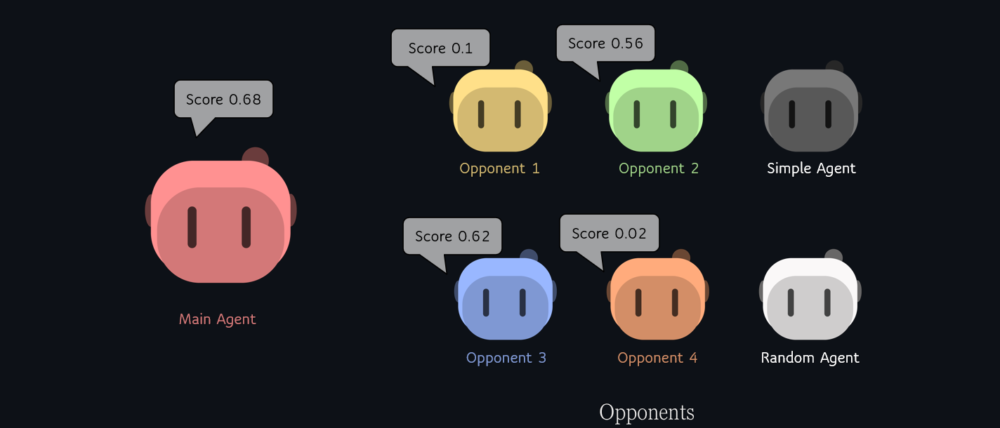

# Pommerman Challenge
This notebook focuses on training a Deep Reinforcement Learning (DRL) agent to excel in the Pommerman Challenge. The Pommerman Tournament involves one-on-one battles on a 6x6 grid, where the agent must navigate the environment, compete against opponents, and make strategic decisions to achieve victory.

## Key Facts
- Pommerman Tournament: The challenge revolves around one-on-one battles on a 6x6 grid.
- Varying Starting Positions: Matches have varying starting positions: 0 represents the top left, 1 the bottom right.
- Sparse and Delayed Rewards: The agent is required to plan ahead and strategize.
- Noisy Reward Signal: Potential opponent suicides cause noise to the reward signal.

## Approach
The chosen approach involves employing a Deep Q-Network (DQN).
Key components of the approach:

- Deep Q-Network: DQN with separate training and target value functions to improve stability and convergence.
- Replay Buffer: To ensure that the training data remains independent and identically distributed (i.i.d.), a replay buffer is employed.
- Agent Network: The best-performing agent network is used as the basis for both the training and target value functions.
- Opponents: The training involves pitting the agent against various opponents. These include four other trained agents, a simple agent, and a random agent.

## Training
The training process consists of the following steps:

- The agent is trained across 2000 episodes against each of the six opponents.
- The total number of training episodes sums up to 6 * 2000 = 12000 episodes.
- The initial starting position for the agent is 1, which is opposite to the position it was trained on. Subsequent training sessions involve alternating starting positions.

